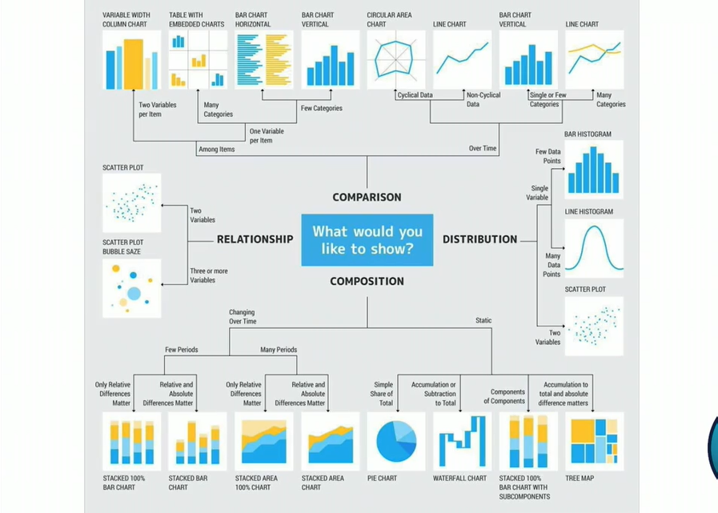
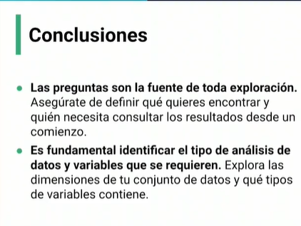

# ¿Que hacer cuando tengo muchas varaibles?

Analisis de componentes principales (PCA)

TSNE (T- Distributed Stochastic Neibghbor Embedding)

Algoritmo de rediccion de dimenciones UMAP: Uniform Manifold Approximation And projection for Dimension Reduction

# Diversidad de graficas al explorar datos

# EDA

