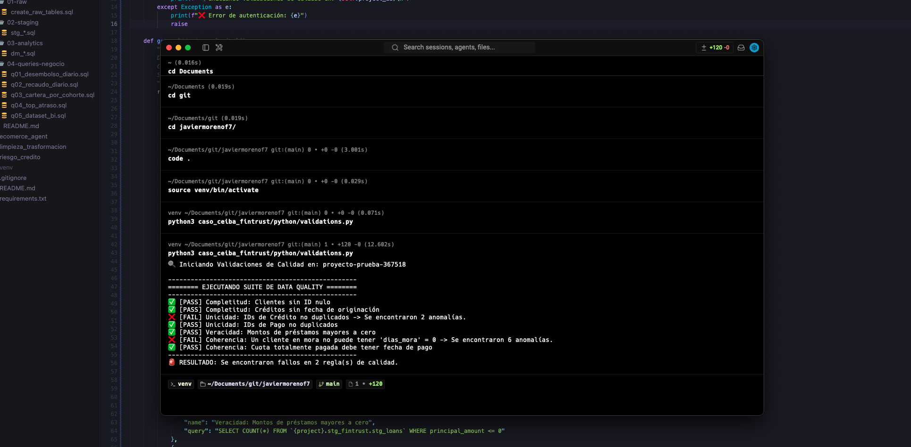

## ⚙️ Ejecutando las Pruebas de Calidad de Datos
 
El sistema cuenta con un motor automatizado de Data Quality (`validations.py`). Para validarlo, ejecuta:
 
```bash
python3 caso_gcp_fintrust/python/validations.py
```
*Se puede vizulizar que se estan detectando errores en la data deacuerdo a las reglas de calidad que se definieron, esto se puede corregir en el codigo, detectando futuras anomalias en la calidad de los datos segun sea el caso*



# Contenidos de tablas 


